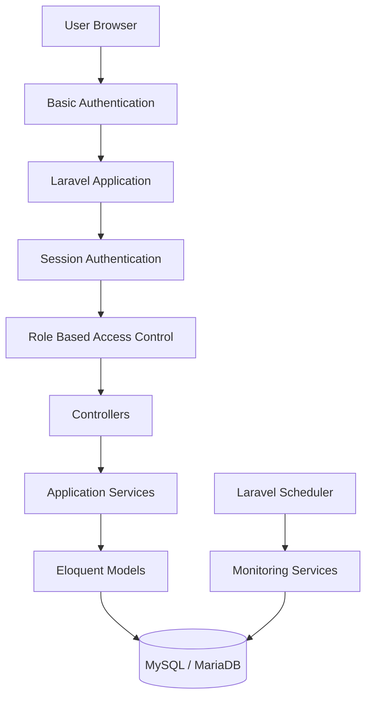
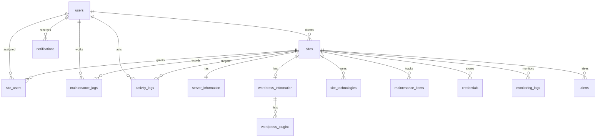

# 社内Webサイト保守管理システム アーキテクチャ設計

## 0. 前提

本システムは、社内で保守している複数Webサイトの状態、契約、環境、更新、認証情報、保守履歴、監査ログを一元管理するLaravel製Webアプリケーションである。

参考サービスの概念は「複数サイトの状態を俯瞰できるSaaS型ダッシュボード」とし、実装は社内のWebサイト保守業務に特化した独自設計とする。

## 1. システム構成

### 採用技術

| 項目 | 技術 |
| --- | --- |
| Backend | Laravel 11系または12系 |
| Language | PHP 8.2以上 |
| Database | MySQL 8.0 / MariaDB 10.6以上 |
| Frontend | Laravel Blade |
| UI補助 | Alpine.js |
| CSS | Tailwind CSS |
| 認証 | Laravel Breeze相当のセッション認証 |
| 認可 | Laravel Policy / Gate / Middleware |
| 定期処理 | Laravel Scheduler + Cron |
| Queue | Database Queueから開始、将来Redis等へ移行可能 |
| 暗号化 | Laravel Crypt / encrypted cast |
| テスト | PHPUnit / Pest |

### レイヤー構成



### 多層防御

1. WebサーバーでBasic認証を設定する。
2. Laravelアプリでメールアドレスとパスワードによるログインを必須にする。
3. Laravel Policyでサイト単位・機能単位の認可を行う。
4. 認証情報の閲覧・コピーは個別権限と監査ログを必須にする。

### 自動取得の方針

1. Laravel Schedulerから `sites:check-health` を定期実行する。
2. 管理対象サイトへHTTPアクセスし、HTTPステータス、応答速度、セキュリティヘッダーを取得する。
3. SSL証明書へ接続し、有効期限を取得する。
4. WordPressサイトは、専用プラグインAPI `wp-json/carearc-maintenance/v1/status` を優先して取得する。
5. 専用プラグインが未導入の場合は公開REST API `wp-json` を確認し、詳細状態は手動確認扱いにする。
6. 自動判定できる内容は `sites.status` と `sites.auto_status_reason` へ反映する。

自動判定できる項目:

- HTTPステータス
- 応答速度
- SSL有効期限
- セキュリティヘッダー有無
- WordPress REST APIの到達可否
- 専用プラグイン導入済みサイトのWordPress本体、PHP、テーマ、プラグイン更新有無

人が確認する項目:

- 契約内容
- 作業範囲
- 表示崩れ
- フォーム仕様と送信確認
- 顧客への確認が必要な運用判断

## 2. ディレクトリ構成

Laravel標準構成を維持し、独自ドメインロジックはServiceとPolicyに分離する。

```text
app/
  Console/Commands/
    CheckSiteHealth.php
    CheckSslCertificates.php
    CheckDomainExpirations.php
  Enums/
    SiteStatus.php
    SiteType.php
    UserRole.php
    MaintenanceStatus.php
  Http/Controllers/
    DashboardController.php
    SiteController.php
    SiteCredentialController.php
    MaintenanceLogController.php
    UserController.php
    AlertController.php
    ActivityLogController.php
    SettingController.php
  Http/Middleware/
    SecurityHeaders.php
    EnsureCredentialReauthentication.php
  Models/
    Site.php
    ServerInformation.php
    WordpressInformation.php
    WordpressPlugin.php
    SiteTechnology.php
    MaintenanceItem.php
    MaintenanceLog.php
    Credential.php
    MonitoringLog.php
    Alert.php
    ActivityLog.php
    Notification.php
  Policies/
    SitePolicy.php
    CredentialPolicy.php
    UserPolicy.php
  Services/
    ActivityLogger.php
    CredentialVault.php
    Monitoring/
      HttpMonitor.php
      SslCertificateInspector.php
      DomainExpirationInspector.php
    Notifications/
      NotificationService.php
      Channels/
        InAppNotificationChannel.php
database/
  migrations/
  seeders/
resources/
  views/
    layouts/
    dashboard.blade.php
    sites/
    credentials/
    maintenance/
    alerts/
    users/
    activity-logs/
routes/
  web.php
  console.php
tests/
  Feature/
  Unit/
docs/
  architecture.md
```

## 3. DB設計

### users

| カラム | 型 | 備考 |
| --- | --- | --- |
| id | bigint | PK |
| name | varchar | 氏名 |
| email | varchar unique | ログインID |
| password | varchar | Laravel標準ハッシュ |
| role | varchar | admin / staff / external_engineer |
| two_factor_enabled | boolean | Phase 2以降で利用 |
| last_login_at | timestamp nullable | 最終ログイン |
| created_at / updated_at | timestamp |  |

### sites

| カラム | 型 | 備考 |
| --- | --- | --- |
| id | bigint | PK |
| company_name | varchar | 企業名 |
| name | varchar | サイト名 |
| url | varchar | サイトURL |
| admin_url | varchar nullable | 管理画面URL |
| type | varchar | wordpress / static_html / php / lp / other |
| status | varchar | normal / needs_check / updates_available / incident / suspended |
| published_on | date nullable | 公開日 |
| maintenance_started_on | date nullable | 保守開始日 |
| maintenance_ended_on | date nullable | 保守終了日 |
| director_id | foreignId nullable | users.id |
| engineer_id | foreignId nullable | users.id |
| github_url | varchar nullable | GitHub URL |
| notes | text nullable | 備考 |
| last_maintained_on | date nullable | 集計用 |
| next_check_on | date nullable | 次回確認予定日 |
| created_by | foreignId nullable | users.id |
| created_at / updated_at / deleted_at | timestamp | 論理削除 |

### site_users

サイト単位のアクセス制御と、外部エンジニアへの割当を管理する。

| カラム | 型 | 備考 |
| --- | --- | --- |
| id | bigint | PK |
| site_id | foreignId | sites.id |
| user_id | foreignId | users.id |
| can_view_site | boolean | サイト基本情報閲覧 |
| can_view_server | boolean | サーバー情報閲覧 |
| can_view_credentials | boolean | 認証情報閲覧 |
| can_edit_credentials | boolean | 認証情報編集 |
| can_view_maintenance | boolean | 保守情報閲覧 |
| can_add_maintenance_log | boolean | 保守履歴追加 |
| created_at / updated_at | timestamp |  |

制約:

- unique(site_id, user_id)
- site削除時はcascade
- user削除時はcascade

### server_information

| カラム | 型 | 備考 |
| --- | --- | --- |
| id | bigint | PK |
| site_id | foreignId unique | sites.id |
| provider | varchar nullable | サーバー会社 |
| plan | varchar nullable | 契約プラン |
| control_panel_url | varchar nullable | 管理画面URL |
| ftp_host | varchar nullable | FTP |
| ssh_host | varchar nullable | SSH |
| php_version | varchar nullable | PHP |
| database_name | varchar nullable | DB情報 |
| ssl_enabled | boolean | SSL有無 |
| ssl_expires_on | date nullable | SSL有効期限 |
| domain_registrar | varchar nullable | ドメイン会社 |
| domain_expires_on | date nullable | ドメイン有効期限 |
| dns_provider | varchar nullable | DNS管理先 |
| cdn | varchar nullable | CDN |
| waf | varchar nullable | WAF |
| basic_auth_enabled | boolean | Basic認証 |
| backup_enabled | boolean | バックアップ |
| backup_frequency | varchar nullable | バックアップ頻度 |
| created_at / updated_at | timestamp |  |

### wordpress_information

| カラム | 型 | 備考 |
| --- | --- | --- |
| id | bigint | PK |
| site_id | foreignId unique | sites.id |
| wordpress_version | varchar nullable | WPバージョン |
| php_version | varchar nullable | PHPバージョン |
| theme_name | varchar nullable | テーマ名 |
| theme_version | varchar nullable | テーマバージョン |
| uses_child_theme | boolean | 子テーマ利用 |
| core_update_available | boolean | 本体更新有無 |
| last_checked_at | timestamp nullable | 最終確認 |
| created_at / updated_at | timestamp |  |

### wordpress_plugins

| カラム | 型 | 備考 |
| --- | --- | --- |
| id | bigint | PK |
| wordpress_information_id | foreignId | wordpress_information.id |
| name | varchar | プラグイン名 |
| current_version | varchar nullable | 現在バージョン |
| latest_version | varchar nullable | 最新バージョン |
| update_status | varchar | current / update_available / unknown |
| last_checked_on | date nullable | 最終確認日 |
| created_at / updated_at | timestamp |  |

### site_technologies

| カラム | 型 | 備考 |
| --- | --- | --- |
| id | bigint | PK |
| site_id | foreignId | sites.id |
| name | varchar | 技術・ライブラリ名 |
| current_version | varchar nullable | 現在バージョン |
| cdn_url | varchar nullable | CDN URL |
| last_checked_on | date nullable | 更新確認日 |
| notes | text nullable | 備考 |
| created_at / updated_at | timestamp |  |

### maintenance_items

| カラム | 型 | 備考 |
| --- | --- | --- |
| id | bigint | PK |
| site_id | foreignId | sites.id |
| category | varchar | wp_core / plugin / theme / php / ssl等 |
| label | varchar | 表示名 |
| status | varchar | normal / needs_check / action_required / not_applicable |
| checked_on | date nullable | 確認日 |
| notes | text nullable | 備考 |
| created_at / updated_at | timestamp |  |

### maintenance_logs

| カラム | 型 | 備考 |
| --- | --- | --- |
| id | bigint | PK |
| site_id | foreignId | sites.id |
| user_id | foreignId nullable | 作業担当者 |
| worked_on | date | 作業日 |
| category | varchar | 作業カテゴリ |
| description | text | 作業内容 |
| minutes_spent | integer nullable | 作業時間 |
| version_before | varchar nullable | 対応前 |
| version_after | varchar nullable | 対応後 |
| repository_url | varchar nullable | Commit / PR URL |
| notes | text nullable | 備考 |
| created_at / updated_at | timestamp |  |

### credentials

| カラム | 型 | 備考 |
| --- | --- | --- |
| id | bigint | PK |
| site_id | foreignId | sites.id |
| type | varchar | wordpress / server / ftp / sftp / ssh / database等 |
| service_name | varchar | サービス名 |
| login_url | varchar nullable | ログインURL |
| login_id | text nullable encrypted | ログインID |
| password | text nullable encrypted | パスワード |
| notes | text nullable encrypted | 備考 |
| last_viewed_at | timestamp nullable | 最終閲覧 |
| created_by | foreignId nullable | users.id |
| updated_by | foreignId nullable | users.id |
| created_at / updated_at / deleted_at | timestamp | 論理削除 |

重要:

- `login_id`, `password`, `notes`はLaravelの暗号化機能で保存する。
- 一覧・初期表示ではパスワードを復号しない。
- 表示・コピー時は専用Controller経由で認可、再認証、監査ログを通す。

### monitoring_logs

| カラム | 型 | 備考 |
| --- | --- | --- |
| id | bigint | PK |
| site_id | foreignId | sites.id |
| checked_at | timestamp | 確認日時 |
| http_status | integer nullable | HTTPステータス |
| response_time_ms | integer nullable | 応答時間 |
| result | varchar | ok / redirect / client_error / server_error / timeout / error |
| error_message | text nullable | エラー |
| created_at / updated_at | timestamp |  |

### alerts

| カラム | 型 | 備考 |
| --- | --- | --- |
| id | bigint | PK |
| site_id | foreignId nullable | sites.id |
| type | varchar | down / ssl_expiring / domain_expiring / wp_update等 |
| severity | varchar | info / warning / critical |
| title | varchar | 件名 |
| body | text nullable | 内容 |
| status | varchar | open / acknowledged / resolved |
| detected_at | timestamp | 検知日時 |
| resolved_at | timestamp nullable | 解決日時 |
| created_at / updated_at | timestamp |  |

### activity_logs

| カラム | 型 | 備考 |
| --- | --- | --- |
| id | bigint | PK |
| user_id | foreignId nullable | 実行ユーザー |
| site_id | foreignId nullable | 対象サイト |
| action | varchar | login / logout / site_created等 |
| target_type | varchar nullable | 対象モデル |
| target_id | bigint nullable | 対象ID |
| ip_address | varchar nullable | IP |
| user_agent | text nullable | UA |
| metadata | json nullable | 差分等 |
| created_at | timestamp | 操作日時 |

### notifications

| カラム | 型 | 備考 |
| --- | --- | --- |
| id | uuid | PK |
| user_id | foreignId | users.id |
| type | varchar | 通知種別 |
| title | varchar | 件名 |
| body | text nullable | 内容 |
| data | json nullable | 詳細 |
| read_at | timestamp nullable | 既読 |
| created_at / updated_at | timestamp |  |

## 4. ER図



## 5. 認証・権限設計

### ロール

| ロール | 説明 |
| --- | --- |
| admin | 全機能利用可能 |
| staff | 許可されたサイトを閲覧し、保守履歴を追加可能 |
| external_engineer | 割り当てられたサイトのみ閲覧可能 |

### 認可方針

Laravel Policyで必ずBackend側の認可を行う。メニュー非表示だけでアクセス制限を代替しない。

| 操作 | admin | staff | external_engineer |
| --- | --- | --- | --- |
| ダッシュボード閲覧 | 全体 | 割当サイト集計 | 割当サイト集計 |
| サイト一覧 | 全サイト | 割当サイト | 割当サイト |
| サイト詳細 | 全サイト | 許可サイト | 許可サイト |
| サイト作成 | 可 | 不可 | 不可 |
| サイト編集 | 可 | 不可 | 不可 |
| サイト削除 | 可 | 不可 | 不可 |
| 保守履歴追加 | 可 | 許可サイト | 許可サイト |
| 認証情報閲覧 | 可 | 個別許可 | 個別許可 |
| 認証情報編集 | 可 | 個別許可 | 不可を初期値 |
| ユーザー管理 | 可 | 不可 | 不可 |
| 監査ログ閲覧 | 可 | 不可 | 不可 |

### 外部エンジニアの直接URLアクセス対策

`SitePolicy::view(User $user, Site $site)`で以下を判定する。

1. adminは許可。
2. staff / external_engineerは`site_users`に該当site_idとuser_idがあり、`can_view_site = true`の場合のみ許可。
3. それ以外は403。

サイト詳細、編集、保守履歴、認証情報表示、コピーAPIなど、サイトIDを受け取る全RouteでPolicyを通す。

## 6. セキュリティ設計

### 必須対策

| 要件 | 対応 |
| --- | --- |
| CSRF | Laravel標準CSRF Middleware |
| XSS | Bladeエスケープ、HTML許可入力は原則禁止 |
| SQL Injection | Eloquent / Query Builder、Raw SQL原則禁止 |
| 認証 | Laravelセッション認証 |
| 認可 | Policy / Gate |
| RBAC | users.role + site_users個別権限 |
| Rate Limit | ログイン、認証情報表示、監視APIにThrottle |
| Secure Cookie | 本番.envでSESSION_SECURE_COOKIE=true |
| HttpOnly Cookie | Laravel標準 |
| SameSite Cookie | laxまたはstrict |
| HTTPS前提 | APP_URL=https、TrustProxies設定 |
| Clickjacking | X-Frame-Options: DENY |
| Content-Type保護 | X-Content-Type-Options: nosniff |
| Referrer Policy | strict-origin-when-cross-origin |
| 監査ログ | ActivityLogger Service |
| パスワード暗号化 | Laravel Crypt encrypted cast |
| 秘密情報除外 | .gitignore / .env.example |

### 認証情報の扱い

- DB保存時は暗号化する。
- 一覧表示では復号しない。
- 詳細画面の初期状態は`**********`表示とする。
- 表示ボタン・コピーボタン押下時のみ専用エンドポイントで復号する。
- 認証情報表示前にパスワード再入力を要求できるMiddlewareを用意する。
- 表示・コピー・編集は`activity_logs`へ必ず記録する。
- 本番秘密情報、実在するパスワード、Basic認証パスワードはSeederやGitに含めない。

### セキュリティヘッダー

`SecurityHeaders` Middlewareで以下を付与する。

```text
X-Frame-Options: DENY
X-Content-Type-Options: nosniff
Referrer-Policy: strict-origin-when-cross-origin
Permissions-Policy: geolocation=(), microphone=(), camera=()
```

CSPは導入するが、Laravel Vite / Alpine.js / Tailwindとの整合を確認しながら段階的に厳格化する。

## 7. 画面一覧

| 画面 | URL | 説明 |
| --- | --- | --- |
| ログイン | /login | メール・パスワード |
| Dashboard | /dashboard | 全体状況、要対応サイト、期限接近 |
| Sites | /sites | サイト一覧、検索、絞り込み |
| Site Create | /sites/create | サイト登録 |
| Site Detail | /sites/{site} | タブ形式詳細 |
| Site Edit | /sites/{site}/edit | サイト編集 |
| Maintenance | /maintenance | 保守履歴横断一覧 |
| Alerts | /alerts | アラート一覧 |
| Credentials | /credentials | 認証情報横断一覧、権限に応じて制御 |
| Users | /users | ユーザー管理 |
| Activity Logs | /activity-logs | 操作ログ |
| Settings | /settings | 監視頻度、通知設定等 |

### Site Detailのタブ

- 概要
- 環境情報
- WordPress
- 保守情報
- 認証情報
- 保守履歴
- メモ

## 8. URL / Route設計

```php
Route::middleware(['auth', 'verified'])->group(function () {
    Route::get('/dashboard', DashboardController::class)->name('dashboard');

    Route::resource('sites', SiteController::class);
    Route::post('/sites/{site}/maintenance-logs', [MaintenanceLogController::class, 'store'])
        ->name('sites.maintenance-logs.store');

    Route::get('/credentials', [SiteCredentialController::class, 'index'])->name('credentials.index');
    Route::post('/credentials/{credential}/reveal', [SiteCredentialController::class, 'reveal'])
        ->middleware(['password.confirm', 'throttle:credential-reveal'])
        ->name('credentials.reveal');
    Route::post('/credentials/{credential}/copy', [SiteCredentialController::class, 'copy'])
        ->middleware(['password.confirm', 'throttle:credential-reveal'])
        ->name('credentials.copy');

    Route::get('/maintenance', [MaintenanceLogController::class, 'index'])->name('maintenance.index');
    Route::get('/alerts', [AlertController::class, 'index'])->name('alerts.index');

    Route::middleware('can:manage-users')->group(function () {
        Route::resource('users', UserController::class);
    });

    Route::middleware('can:view-activity-logs')->group(function () {
        Route::get('/activity-logs', [ActivityLogController::class, 'index'])->name('activity-logs.index');
    });

    Route::middleware('can:manage-settings')->group(function () {
        Route::get('/settings', [SettingController::class, 'edit'])->name('settings.edit');
        Route::put('/settings', [SettingController::class, 'update'])->name('settings.update');
    });
});
```

## 9. Phase 1実装計画

Phase 1は、手入力でWebサイト保守情報を安全に管理できるMVPとする。HTTP監視、SSL自動確認、ドメイン自動確認はPhase 2で実装するが、DBとUIには手動入力欄を持たせる。

### Step 1: Laravel基盤

- Laravelプロジェクト作成
- Breeze相当のログイン機能導入
- Tailwind CSS導入
- `.env.example`と`.gitignore`整備
- READMEに環境構築手順を記載

### Step 2: DBとModel

- users拡張
- sites
- site_users
- server_information
- wordpress_information
- wordpress_plugins
- site_technologies
- maintenance_items
- maintenance_logs
- credentials
- monitoring_logs
- alerts
- activity_logs
- notifications

すべてmigrationで作成し、Foreign Keyと削除ポリシーを明示する。

### Step 3: 認証・認可

- UserRole Enum
- SitePolicy
- CredentialPolicy
- UserPolicy
- admin / staff / external_engineerの権限制御
- 外部エンジニアの直接URLアクセス403テスト

### Step 4: 監査ログ

- ActivityLogger Service
- ログイン / ログアウト記録
- サイト作成 / 編集 / 削除記録
- 認証情報表示 / コピー / 変更記録
- 保守履歴追加記録
- ユーザー追加 / 削除 / 権限変更記録

### Step 5: サイト管理UI

- SaaS型サイドバー
- Dashboard
- Sites一覧
- 検索・絞り込み
- サイト作成
- サイト編集
- サイト詳細タブ
- ステータス色分け

### Step 6: 保守管理UI

- 保守項目の一覧・更新
- 保守履歴追加
- 保守履歴時系列表示

### Step 7: 認証情報UI

- 認証情報登録・編集
- 暗号化保存
- 初期マスク表示
- 表示 / コピーAPI
- 再認証
- 監査ログ

### Step 8: Seeder

架空データのみ登録する。

- 管理者ユーザー
- 社内スタッフ
- 外部エンジニアA
- 外部エンジニアB
- WordPressサイト数件
- 静的サイト数件
- PHPサイト数件
- ダミー認証情報

### Step 9: テスト

最低限以下をFeature Testで確認する。

- ログインできる
- 未ログイン時は保護ページへアクセスできない
- adminは全サイト閲覧可能
- staffは割当サイトのみ閲覧可能
- external_engineerは割当サイトのみ閲覧可能
- 外部エンジニアAが外部エンジニアBのサイト詳細URLを直接入力しても403
- サイト追加
- サイト編集
- サイト削除
- 認証情報が平文保存されない
- 認証情報表示時に監査ログが残る
- 保守履歴追加
- 保守履歴追加時に監査ログが残る

## 10. Phase 2以降の設計方針

### Phase 2

- HTTP死活監視
- SSL期限確認
- RDAPによるドメイン期限確認
- アラート生成
- アプリ内通知
- 監視頻度設定

### Phase 3

- WordPress専用連携プラグイン
- サイトごとのAPI KeyまたはHMAC署名
- WordPress / PHP / テーマ / プラグイン情報自動送信
- 接続キーの暗号化保存

### Phase 4

- Slack通知
- Email通知
- Chatwork通知
- Webhook通知
- 月次レポート
- 保守統計

## 11. 実装前チェック

現時点での重大リスクと対策は以下。

| リスク | 対策 |
| --- | --- |
| 認証情報の漏えい | encrypted cast、再認証、監査ログ、権限制御 |
| 外部エンジニアによる他社サイト閲覧 | SitePolicyでBackend認可 |
| 秘密情報のGit混入 | .gitignore、.env.example、Seederは架空情報のみ |
| 監視処理の密結合 | Monitoring Serviceとして分離 |
| 通知の密結合 | Notification Service + Channel構成 |
| 削除による履歴欠落 | sites / credentialsは原則論理削除 |

この設計でPhase 1を開始して問題ない。
